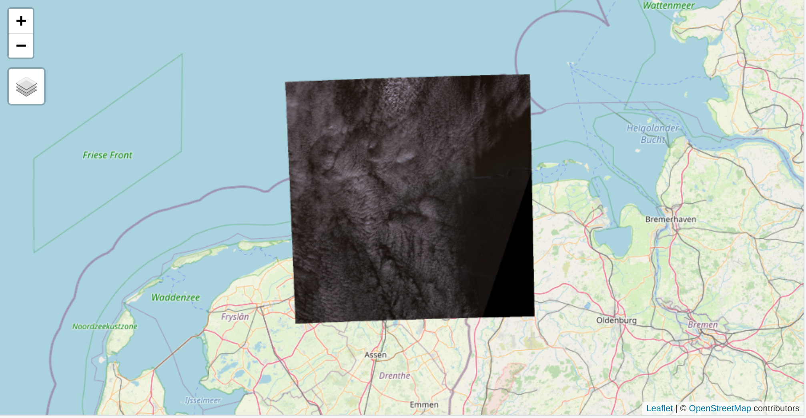

  
```{r setup, include=FALSE}
knitr::opts_chunk$set(echo = TRUE)
```

## Installation of stars and tmap 

We recommend to install the github version of **stars**, and the CRAN version of **tmap**:
  
```{r, eval=FALSE}
if (!require(remotes))
install.packages("remotes")
remotes::install_github("r-spatial/stars")
install.packages("starsdata", repos = "https://gis-bigdata.uni-muenster.de/pebesma", type = "source")
install.packages("tmap")
```

Load the packages:
  
```{r}
library(stars)
library(tmap)
```

## Landset-7 image

This example shows a small image from the Landset-7 satellite:

```{r}
L7file = system.file("tif/L7_ETMs.tif", package = "stars")
(L7 = read_stars(L7file))
```

Raster data cubes can be plot with `tm_raster` as follows:
  
```{r}
tm_shape(L7) +
  tm_raster()
```

Note that most values are around 50 to 100. In order to create more contrast, we can use the *kmeans* algorithm, which creates clusters (by default 5). Note that data for which we apply kmeans is one dimensional.

```{r}
tm_shape(L7) +
  tm_raster(style = "kmeans")
```

We can also create an rgb image as with `tm_rgb`:

```{r}
tm_shape(L7) +
  tm_rgb(3, 2, 1)
```

The image is a bit too dark due to the low values; recall that most values are around 50-100, while the value range is from 0 to 255.
Let us look at the histogram:

```{r}
hist(L7[[1]], breaks = 100)
```

Since `tm_rgb` plot the data values 'as is', so without transformations, we can apply the transformation in advance.


```{r}
library(dplyr)
L7_mod = L7 %>% st_apply(3, pmax, 25) %>% 
  st_apply(3, pmin, 150) %>% 
  '-'(25)

tm_shape(L7_mod) +
  tm_rgb(3, 2, 1, max.value = 125)
```

We can show the old image and the new image side by side with `tmap_arrange`:


```{r}
tmap_arrange(
tm_shape(L7) +
  tm_rgb(3, 2, 1),
tm_shape(L7_mod) +
  tm_rgb(3, 2, 1, max.value = 125)
)


```

We can also draw a false color image, by drawing the bands near-infrared, red, and green. This technique is often used in earth observation data.

```{r}
tm_shape(L7_mod) +
    tm_rgb(4, 3, 2, max.value = 125)
```

## Weather data

Monthly precipitation and average temperature of North Carolina

Load the weather dataset with two attributes, the monthly precipitation `pr` (mm per month), and the average temperature `C` in Celcius:

```{r}
(w = system.file("nc/bcsd_obs_1999.nc", package = "stars") %>%
    read_stars("data/full_data_daily_2013.nc"))
```


Load the county borders of North Carolina:

```{r}
nc = read_sf(system.file("gpkg/nc.gpkg", package="sf"))
```

For weather maps, it is common to use a blue palette for precipitation, and a rainbow palette for temperature. Two widely used sets of color palettes are ColorBrewer and viridis, which are implemented in the packages **RColorBrewer** and **viridisLite**, but both are imported by **tmap**, so they can be used directly. The corresponding palettes can be explored with a shiny app initiated with \code{tmaptools::palette_explorer()}. It is also worth checking the **pals** package, which contains many more color palettes.

In the next code chunk, we map precepitation to a continuous color scale, where we use "Blues" from ColorBrewer.

```{r}
tm_shape(w[1]) +
  tm_raster(title = "Precipitation [mm/m]", palette = "Blues", style = "cont") +
tm_shape(nc) +
  tm_borders()
```

For temperature, we use a rainbow palette from the **pals** package. We choose discrete color classes in order to be able to improve readability. Both methods (discrete vs continuous color scales) have pros and cons. It is recommended to experiment with both of them to find out which one is better for the task at hand.

```{r}
tm_shape(w[2]) +
  tm_raster(title = "Temperature [C]", palette = pals::kovesi.rainbow(n=10), midpoint = 15) +
tm_shape(nc) +
  tm_borders()
```


## Large Sentinel-2 data

A large Snetinel-2 image is contained in the **starsdata** package:

```{r}
granule = system.file("sentinel/S2A_MSIL1C_20180220T105051_N0206_R051_T32ULE_20180221T134037.zip", 
  package = "starsdata")
s2 = paste0("SENTINEL2_L1C:/vsizip/", granule, 
  "/S2A_MSIL1C_20180220T105051_N0206_R051_T32ULE_20180221T134037.SAFE/MTD_MSIL1C.xml:10m:EPSG_32632")
(p = read_stars(s2))
```

Note that `p` is a `stars_proxy` object, so the data is not stored into memory. When we plot it with **tmap**, where this time we use the `qtm` (quick thematic map) function, the object is downsampled automatically by default.

```{r}
qtm(p)
```

Downsampling can be turned off with the following code. However, this can be very slow.

```{r,eval=FALSE}
tm_shape(p, raster.downsample = FALSE) + 
  tm_raster()
```

We can plot the image by using `tm_rgb`. For the red, green, and blue channel, we need bands 4, 3, and 2 respectively (see https://en.wikipedia.org/wiki/Sentinel-2).

```{r}
tm_shape(p) +
  tm_rgb(4,3,2, max.value = 14000)
```


## Warping and transforming stars

When stars need to be converted into another projection (CRS), **tmap** will use warping by default, since this is much quicker. A transformed stars object is often not regular anymore, so under the hood it has to be converted to polygons, which can be time consuming.

We see such as warped raster when plotting the last map in interactive ("view") mode:

```{r,eval=FALSE}
tmap_mode("view")
tm_shape(p) +
  tm_rgb(3,2,1, max.value = 14000)
```

```{r}

```

The tmap option `max.raster` controls the number of cells to which stars objects are downsampled. By default, it is 1 million, but for small multiples, it is better to use lower values:

```{r}
tmap_options(max.raster = c(plot = 1e4, view = 1e4))
```

Raster objects are by default warped. When we disable warping, cell are converted to polygons:

```{r}
tm_shape(p, raster.warp = FALSE) +
  tm_rgb(3,2,1, max.value = 14000)
```


## Time series

The following code chunk loads data from the **starsdata** package

```{r,echo=FALSE,warning=FALSE,message=FALSE}
x = c(
  "avhrr-only-v2.19810901.nc",
  "avhrr-only-v2.19810902.nc",
  "avhrr-only-v2.19810903.nc",
  "avhrr-only-v2.19810904.nc",
  "avhrr-only-v2.19810905.nc",
  "avhrr-only-v2.19810906.nc",
  "avhrr-only-v2.19810907.nc",
  "avhrr-only-v2.19810908.nc",
  "avhrr-only-v2.19810909.nc"
)
file_list = system.file(paste0("netcdf/", x), package = "starsdata")
(y = read_stars(file_list, quiet = TRUE))
(z = adrop(y))

```

The following code shows a time series plot of the first attribute. The parameter `midpoint` defines the neutral color of the diverging palette.

```{r}
tm_shape(z[1]) +
  tm_raster(midpoint = 15, n = 7, style = "quantile")
```
