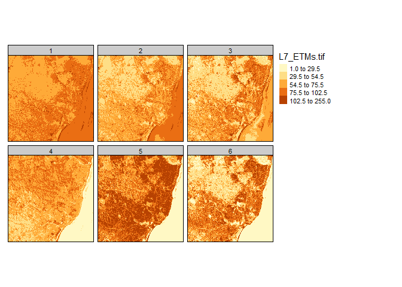
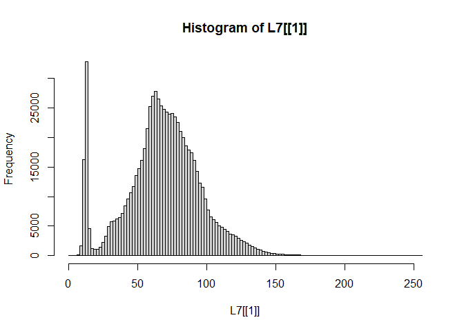
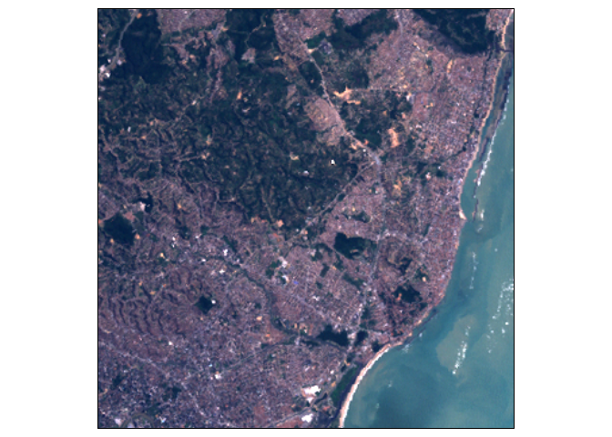
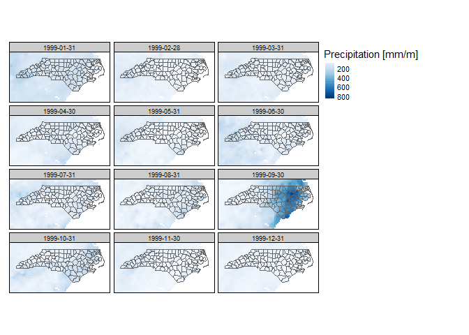

Visualization of raster data cubes with tmap
================
Martijn Tennekes
9/18/2020

## Installation of stars and tmap

We recommend to install the github version of **stars**, and the CRAN
version of **tmap**:

``` r
if (!require(remotes))
install.packages("remotes")
remotes::install_github("r-spatial/stars")
#install.packages("starsdata", repos = "https://gis-bigdata.uni-muenster.de/pebesma", type = "source")
install.packages("tmap")
```

Load the packages:

``` r
library(stars)
```

    ## Loading required package: abind

    ## Loading required package: sf

    ## Linking to GEOS 3.8.0, GDAL 3.0.4, PROJ 6.3.1

``` r
library(tmap)
```

## Landset-7 image

This example shows a small image from the Landset-7 satellite:

``` r
L7file = system.file("tif/L7_ETMs.tif", package = "stars")
(L7 = read_stars(L7file))
```

    ## stars object with 3 dimensions and 1 attribute
    ## attribute(s):
    ##   L7_ETMs.tif    
    ##  Min.   :  1.00  
    ##  1st Qu.: 54.00  
    ##  Median : 69.00  
    ##  Mean   : 68.91  
    ##  3rd Qu.: 86.00  
    ##  Max.   :255.00  
    ## dimension(s):
    ##      from  to  offset delta                       refsys point values x/y
    ## x       1 349  288776  28.5 UTM Zone 25, Southern Hem... FALSE   NULL [x]
    ## y       1 352 9120761 -28.5 UTM Zone 25, Southern Hem... FALSE   NULL [y]
    ## band    1   6      NA    NA                           NA    NA   NULL

Raster data cubes can be plot with `tm_raster` as follows:

``` r
tm_shape(L7) +
  tm_raster()
```

<!-- -->

Note that most values are around 50 to 100. In order to create more
contrast, we can use the *kmeans* algorithm, which creates clusters (by
default 5). Note that data for which we apply kmeans is one dimensional.

``` r
tm_shape(L7) +
  tm_raster(style = "kmeans")
```

<!-- -->

We can also create an rgb image as with `tm_rgb`:

``` r
tm_shape(L7) +
  tm_rgb(1, 2, 3)
```

<!-- -->

The image is a bit too dark due to the low values; recall that most
values are around 50-100, while the value range is from 0 to 255. Let us
look at the histogram:

``` r
hist(L7[[1]], breaks = 100)
```

<!-- -->

Since `tm_rgb` plot the data values ‘as is’, so without transformations,
we can apply the transformation in advance.

``` r
library(dplyr)
```

    ## 
    ## Attaching package: 'dplyr'

    ## The following objects are masked from 'package:stats':
    ## 
    ##     filter, lag

    ## The following objects are masked from 'package:base':
    ## 
    ##     intersect, setdiff, setequal, union

``` r
L7_mod = L7 %>% st_apply(3, pmax, 25) %>% 
  st_apply(3, pmin, 150) %>% 
  '-'(25)

tm_shape(L7_mod) +
  tm_rgb(1, 2, 3, max.value = 125)
```

<!-- -->

## Weather data

Monthly precipitation and average temperature of North Carolina

Load the weather dataset with two attributes, the monthly precipitation
`pr` (mm per month), and the average temperature `C` in Celcius:

``` r
(w = system.file("nc/bcsd_obs_1999.nc", package = "stars") %>%
    read_stars("data/full_data_daily_2013.nc"))
```

    ## pr, tas,

    ## stars object with 3 dimensions and 2 attributes
    ## attribute(s):
    ##    pr [mm/m]         tas [C]      
    ##  Min.   :  0.59   Min.   :-0.421  
    ##  1st Qu.: 56.14   1st Qu.: 8.899  
    ##  Median : 81.88   Median :15.658  
    ##  Mean   :101.26   Mean   :15.489  
    ##  3rd Qu.:121.07   3rd Qu.:21.780  
    ##  Max.   :848.55   Max.   :29.386  
    ##  NA's   :7116     NA's   :7116    
    ## dimension(s):
    ##      from to offset  delta  refsys point                    values x/y
    ## x       1 81    -85  0.125      NA    NA                      NULL [x]
    ## y       1 33 37.125 -0.125      NA    NA                      NULL [y]
    ## time    1 12     NA     NA POSIXct    NA 1999-01-31,...,1999-12-31

Load the county borders of North Carolina:

``` r
nc = read_sf(system.file("gpkg/nc.gpkg", package="sf"))
```

For weather maps, it is common to use a blue palette for precipitation,
and a rainbow palette for temperature. Two widely used sets of color
palettes are ColorBrewer and viridis, which are implemented in the
packages **RColorBrewer** and **viridisLite**, but both are imported by
**tmap**, so they can be used directly. The corresponding palettes can
be explored with a shiny app initiated with . It is also worth checking
the **pals** package, which contains many more color palettes.

In the next code chunk, we map precepitation to a continuous color
scale, where we use “Blues” from ColorBrewer.

``` r
tm_shape(w[1]) +
  tm_raster(title = "Precipitation [mm/m]", palette = "Blues", style = "cont") +
tm_shape(nc) +
  tm_borders()
```

    ## Warning: Currect projection of shape w[1] unknown. Long lat (epsg 4326)
    ## coordinates assumed.

<!-- -->

For temperature, we use a rainbow palette from the **pals** package. We
choose discrete color classes in order to be able to improve
readability. Both methods (discrete vs continuous color scales) have
pros and cons. It is recommended to experiment with both of them to find
out which one is better for the task at hand.

``` r
tm_shape(w[2]) +
  tm_raster(title = "Temperature [C]", palette = pals::kovesi.rainbow(n=10), midpoint = 15) +
tm_shape(nc) +
  tm_borders()
```

    ## Warning: Currect projection of shape w[2] unknown. Long lat (epsg 4326)
    ## coordinates assumed.

<!-- -->
