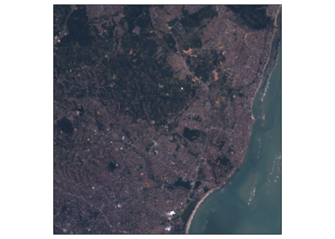
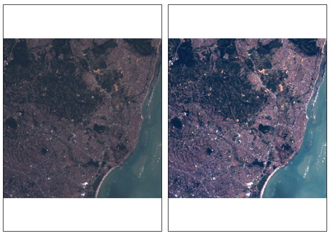
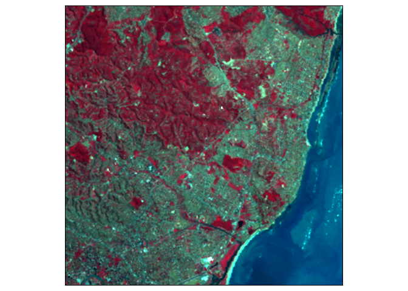
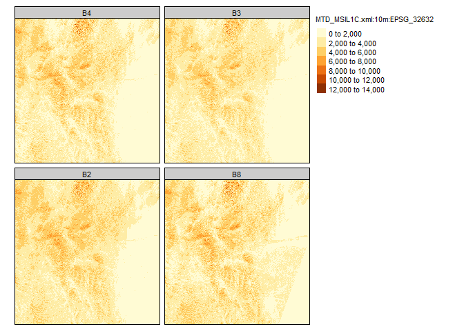
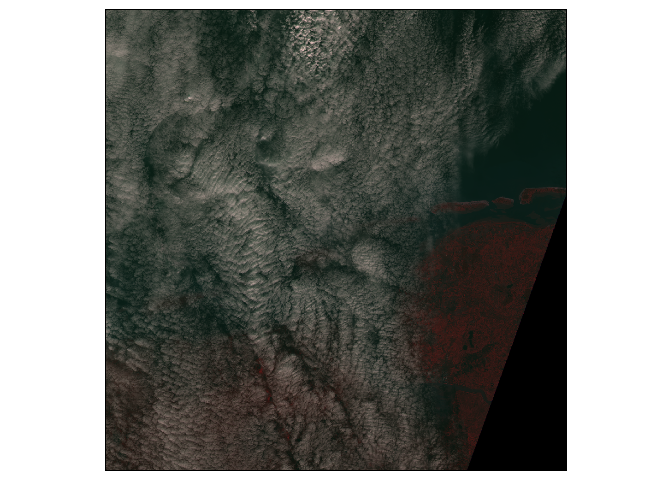
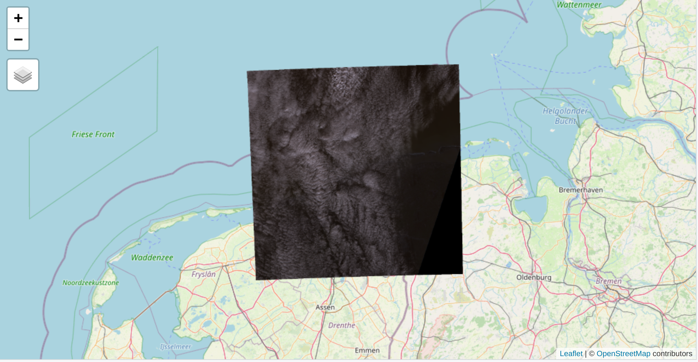
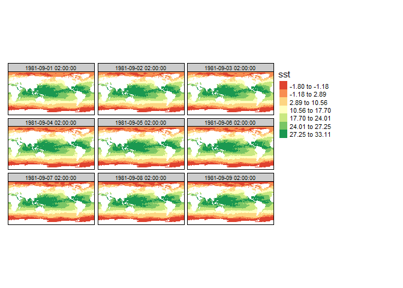

Visualization of raster data cubes with tmap
================
Martijn Tennekes
9/18/2020

## Installation of stars and tmap

We recommend to install the github version of **stars**, and the CRAN
version of **tmap**:

``` r
if (!require(remotes))
install.packages("remotes")
remotes::install_github("r-spatial/stars")
install.packages("starsdata", repos = "https://gis-bigdata.uni-muenster.de/pebesma", type = "source")
install.packages("tmap")
```

Load the packages:

``` r
library(stars)
```

    ## Loading required package: abind

    ## Loading required package: sf

    ## Linking to GEOS 3.8.0, GDAL 3.0.4, PROJ 6.3.1

``` r
library(tmap)
```

## Landset-7 image

This example shows a small image from the Landset-7 satellite:

``` r
L7file = system.file("tif/L7_ETMs.tif", package = "stars")
(L7 = read_stars(L7file))
```

    ## stars object with 3 dimensions and 1 attribute
    ## attribute(s):
    ##   L7_ETMs.tif    
    ##  Min.   :  1.00  
    ##  1st Qu.: 54.00  
    ##  Median : 69.00  
    ##  Mean   : 68.91  
    ##  3rd Qu.: 86.00  
    ##  Max.   :255.00  
    ## dimension(s):
    ##      from  to  offset delta                       refsys point values x/y
    ## x       1 349  288776  28.5 UTM Zone 25, Southern Hem... FALSE   NULL [x]
    ## y       1 352 9120761 -28.5 UTM Zone 25, Southern Hem... FALSE   NULL [y]
    ## band    1   6      NA    NA                           NA    NA   NULL

Raster data cubes can be plot with `tm_raster` as follows:

``` r
tm_shape(L7) +
  tm_raster()
```

<!-- -->

Note that most values are around 50 to 100. In order to create more
contrast, we can use the *kmeans* algorithm, which creates clusters (by
default 5). Note that data for which we apply kmeans is one dimensional.

``` r
tm_shape(L7) +
  tm_raster(style = "kmeans")
```

<!-- -->

We can also create an rgb image as with `tm_rgb`:

``` r
tm_shape(L7) +
  tm_rgb(3, 2, 1)
```

<!-- -->

The image is a bit too dark due to the low values; recall that most
values are around 50-100, while the value range is from 0 to 255. Let us
look at the histogram:

``` r
hist(L7[[1]], breaks = 100)
```

<!-- -->

Since `tm_rgb` plot the data values ‘as is’, so without transformations,
we can apply the transformation in advance.

``` r
library(dplyr)
```

    ## 
    ## Attaching package: 'dplyr'

    ## The following objects are masked from 'package:stats':
    ## 
    ##     filter, lag

    ## The following objects are masked from 'package:base':
    ## 
    ##     intersect, setdiff, setequal, union

``` r
L7_mod = L7 %>% st_apply(3, pmax, 25) %>% 
  st_apply(3, pmin, 150) %>% 
  '-'(25)

tm_shape(L7_mod) +
  tm_rgb(3, 2, 1, max.value = 125)
```

<!-- -->

We can show the old image and the new image side by side with
`tmap_arrange`:

``` r
tmap_arrange(
tm_shape(L7) +
  tm_rgb(3, 2, 1),
tm_shape(L7_mod) +
  tm_rgb(3, 2, 1, max.value = 125)
)
```

<!-- -->

We can also draw a false color image, by drawing the bands
near-infrared, red, and green. This technique is often used in earth
observation data.

``` r
tm_shape(L7_mod) +
    tm_rgb(4, 3, 2, max.value = 125)
```

<!-- -->

## Weather data

Monthly precipitation and average temperature of North Carolina

Load the weather dataset with two attributes, the monthly precipitation
`pr` (mm per month), and the average temperature `C` in Celcius:

``` r
(w = system.file("nc/bcsd_obs_1999.nc", package = "stars") %>%
    read_stars("data/full_data_daily_2013.nc"))
```

    ## Warning in CPL_read_gdal(as.character(x), as.character(options),
    ## as.character(driver), : GDAL Message 1: Recode from UTF-8 to CP_ACP failed with
    ## the error: "Invalid argument".
    
    ## Warning in CPL_read_gdal(as.character(x), as.character(options),
    ## as.character(driver), : GDAL Message 1: Recode from UTF-8 to CP_ACP failed with
    ## the error: "Invalid argument".
    
    ## Warning in CPL_read_gdal(as.character(x), as.character(options),
    ## as.character(driver), : GDAL Message 1: Recode from UTF-8 to CP_ACP failed with
    ## the error: "Invalid argument".
    
    ## Warning in CPL_read_gdal(as.character(x), as.character(options),
    ## as.character(driver), : GDAL Message 1: Recode from UTF-8 to CP_ACP failed with
    ## the error: "Invalid argument".

    ## pr,

    ## Warning in CPL_read_gdal(as.character(x), as.character(options),
    ## as.character(driver), : GDAL Message 1: Recode from UTF-8 to CP_ACP failed with
    ## the error: "Invalid argument".

    ## tas,

    ## Warning in CPL_read_gdal(as.character(x), as.character(options),
    ## as.character(driver), : GDAL Message 1: Recode from UTF-8 to CP_ACP failed with
    ## the error: "Invalid argument".

    ## stars object with 3 dimensions and 2 attributes
    ## attribute(s):
    ##    pr [mm/m]         tas [C]      
    ##  Min.   :  0.59   Min.   :-0.421  
    ##  1st Qu.: 56.14   1st Qu.: 8.899  
    ##  Median : 81.88   Median :15.658  
    ##  Mean   :101.26   Mean   :15.489  
    ##  3rd Qu.:121.07   3rd Qu.:21.780  
    ##  Max.   :848.55   Max.   :29.386  
    ##  NA's   :7116     NA's   :7116    
    ## dimension(s):
    ##      from to offset  delta  refsys point                    values x/y
    ## x       1 81    -85  0.125      NA    NA                      NULL [x]
    ## y       1 33 37.125 -0.125      NA    NA                      NULL [y]
    ## time    1 12     NA     NA POSIXct    NA 1999-01-31,...,1999-12-31

Load the county borders of North Carolina:

``` r
nc = read_sf(system.file("gpkg/nc.gpkg", package="sf"))
```

For weather maps, it is common to use a blue palette for precipitation,
and a rainbow palette for temperature. Two widely used sets of color
palettes are ColorBrewer and viridis, which are implemented in the
packages **RColorBrewer** and **viridisLite**, but both are imported by
**tmap**, so they can be used directly. The corresponding palettes can
be explored with a shiny app initiated with . It is also worth checking
the **pals** package, which contains many more color palettes.

In the next code chunk, we map precepitation to a continuous color
scale, where we use “Blues” from ColorBrewer.

``` r
tm_shape(w[1]) +
  tm_raster(title = "Precipitation [mm/m]", palette = "Blues", style = "cont") +
tm_shape(nc) +
  tm_borders()
```

    ## Warning: Currect projection of shape w[1] unknown. Long lat (epsg 4326)
    ## coordinates assumed.

<!-- -->

For temperature, we use a rainbow palette from the **pals** package. We
choose discrete color classes in order to be able to improve
readability. Both methods (discrete vs continuous color scales) have
pros and cons. It is recommended to experiment with both of them to find
out which one is better for the task at hand.

``` r
tm_shape(w[2]) +
  tm_raster(title = "Temperature [C]", palette = pals::kovesi.rainbow(n=10), midpoint = 15) +
tm_shape(nc) +
  tm_borders()
```

    ## Warning: Currect projection of shape w[2] unknown. Long lat (epsg 4326)
    ## coordinates assumed.

<!-- -->

## Large Sentinel-2 data

A large Snetinel-2 image is contained in the **starsdata** package:

``` r
granule = system.file("sentinel/S2A_MSIL1C_20180220T105051_N0206_R051_T32ULE_20180221T134037.zip", 
  package = "starsdata")
s2 = paste0("SENTINEL2_L1C:/vsizip/", granule, 
  "/S2A_MSIL1C_20180220T105051_N0206_R051_T32ULE_20180221T134037.SAFE/MTD_MSIL1C.xml:10m:EPSG_32632")
(p = read_stars(s2))
```

    ## stars_proxy object with 1 attribute in file:
    ## $`MTD_MSIL1C.xml:10m:EPSG_32632`
    ## [1] "[...]/MTD_MSIL1C.xml:10m:EPSG_32632"
    ## 
    ## dimension(s):
    ##      from    to offset delta                refsys point    values x/y
    ## x       1 10980  3e+05    10 WGS 84 / UTM zone 32N    NA      NULL [x]
    ## y       1 10980  6e+06   -10 WGS 84 / UTM zone 32N    NA      NULL [y]
    ## band    1     4     NA    NA                    NA    NA B4,...,B8

Note that `p` is a `stars_proxy` object, so the data is not stored into
memory. When we plot it with **tmap**, where this time we use the `qtm`
(quick thematic map) function, the object is downsampled automatically
by default.

``` r
qtm(p)
```

    ## stars_proxy object shown at 1000 by 1000 cells.

<!-- -->

Downsampling can be turned off with the following code. However, this
can be very slow.

``` r
tm_shape(p, raster.downsample = FALSE) + 
  tm_raster()
```

We can plot the image by using `tm_rgb`. For the red, green, and blue
channel, we need bands 4, 3, and 2 respectively (see
<https://en.wikipedia.org/wiki/Sentinel-2>).

``` r
tm_shape(p) +
  tm_rgb(4,3,2, max.value = 14000)
```

    ## stars_proxy object shown at 1000 by 1000 cells.

<!-- -->

## Warping and transforming stars

When stars need to be converted into another projection (CRS), **tmap**
will use warping by default, since this is much quicker. A transformed
stars object is often not regular anymore, so under the hood it has to
be converted to polygons, which can be time consuming.

We see such as warped raster when plotting the last map in interactive
(“view”) mode:

``` r
tmap_mode("view")
tm_shape(p) +
  tm_rgb(3,2,1, max.value = 14000)
```

``` r

```


The tmap option `max.raster` controls the number of cells to which stars
objects are downsampled. By default, it is 1 million, but for small
multiples, it is better to use lower values:

``` r
tmap_options(max.raster = c(plot = 1e4, view = 1e4))
```

Raster objects are by default warped. When we disable warping, cell are
converted to polygons:

``` r
tm_shape(p, raster.warp = FALSE) +
  tm_rgb(3,2,1, max.value = 14000)
```

    ## stars_proxy object shown at 100 by 100 cells.

<!-- -->

## Time series

The following code chunk loads data from the **starsdata** package

    ## stars object with 4 dimensions and 4 attributes
    ## attribute(s), summary of first 1e+05 cells:
    ##    sst [°*C]       anom [°*C]      err [°*C]     ice [percent]  
    ##  Min.   :-1.80   Min.   :-4.69   Min.   :0.110   Min.   :0.010  
    ##  1st Qu.:-1.19   1st Qu.:-0.06   1st Qu.:0.300   1st Qu.:0.730  
    ##  Median :-1.05   Median : 0.52   Median :0.300   Median :0.830  
    ##  Mean   :-0.32   Mean   : 0.23   Mean   :0.295   Mean   :0.766  
    ##  3rd Qu.:-0.20   3rd Qu.: 0.71   3rd Qu.:0.300   3rd Qu.:0.870  
    ##  Max.   : 9.36   Max.   : 3.70   Max.   :0.480   Max.   :1.000  
    ##  NA's   :13360   NA's   :13360   NA's   :13360   NA's   :27377  
    ## dimension(s):
    ##      from   to                   offset  delta  refsys point values x/y
    ## x       1 1440                        0   0.25      NA    NA   NULL [x]
    ## y       1  720                       90  -0.25      NA    NA   NULL [y]
    ## zlev    1    1                    0 [m]     NA      NA    NA   NULL    
    ## time    1    9 1981-09-01 02:00:00 CEST 1 days POSIXct    NA   NULL

    ## stars object with 3 dimensions and 4 attributes
    ## attribute(s), summary of first 1e+05 cells:
    ##    sst [°*C]       anom [°*C]      err [°*C]     ice [percent]  
    ##  Min.   :-1.80   Min.   :-4.69   Min.   :0.110   Min.   :0.010  
    ##  1st Qu.:-1.19   1st Qu.:-0.06   1st Qu.:0.300   1st Qu.:0.730  
    ##  Median :-1.05   Median : 0.52   Median :0.300   Median :0.830  
    ##  Mean   :-0.32   Mean   : 0.23   Mean   :0.295   Mean   :0.766  
    ##  3rd Qu.:-0.20   3rd Qu.: 0.71   3rd Qu.:0.300   3rd Qu.:0.870  
    ##  Max.   : 9.36   Max.   : 3.70   Max.   :0.480   Max.   :1.000  
    ##  NA's   :13360   NA's   :13360   NA's   :13360   NA's   :27377  
    ## dimension(s):
    ##      from   to                   offset  delta  refsys point values x/y
    ## x       1 1440                        0   0.25      NA    NA   NULL [x]
    ## y       1  720                       90  -0.25      NA    NA   NULL [y]
    ## time    1    9 1981-09-01 02:00:00 CEST 1 days POSIXct    NA   NULL

The following code shows a time series plot of the first attribute. The
parameter `midpoint` defines the neutral color of the diverging palette.

``` r
tm_shape(z[1]) +
  tm_raster(midpoint = 15, n = 7, style = "quantile")
```

    ## Warning: The projection of the shape object z[1] is not known, while it seems to
    ## be projected.

    ## stars object downsampled to 142 by 71 cells. See tm_shape manual (argument raster.downsample)

    ## Warning: Current projection of shape z[1] unknown and cannot be determined.

<!-- -->
