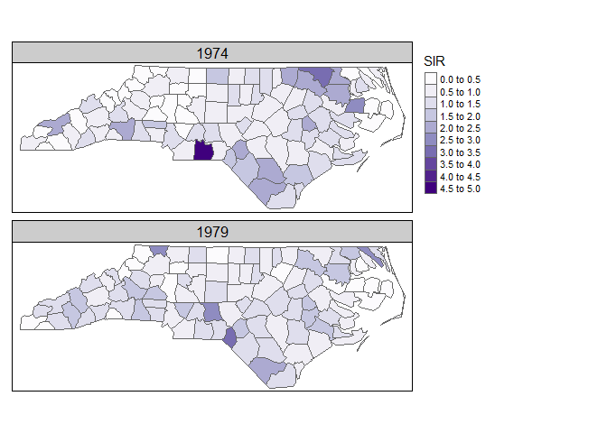

Visualization of vector data cubes with tmap
================
Martijn Tennekes
9/18/2020

## Installation of stars and tmap

We recommend to install the github version of **stars**, and the CRAN
version of **tmap**:

``` r
if (!require(remotes))
  install.packages("remotes")
remotes::install_github("r-spatial/stars")
#install.packages("starsdata", repos = "https://gis-bigdata.uni-muenster.de/pebesma", type = "source")
install.packages("tmap")
```

Load the packages:

``` r
library(stars)
```

    ## Loading required package: abind

    ## Loading required package: sf

    ## Linking to GEOS 3.8.0, GDAL 3.0.4, PROJ 6.3.1

``` r
library(tmap)
```

## North Carolina example

This example is the North Carolina SIDS (sudden infant death syndrome)
data set. See
<https://edzer.github.io/UseR2020/#Vector_data_cube:_North_Carolina_SIDS>

The code to create the vector cube is the following:

``` r
nc = read_sf(system.file("gpkg/nc.gpkg", package="sf"))
nc.df = st_set_geometry(nc, NULL) # m is a regular, non-spatial data.frame
head(nc.df)
```

    ## # A tibble: 6 x 14
    ##    AREA PERIMETER CNTY_ CNTY_ID NAME  FIPS  FIPSNO CRESS_ID BIR74 SID74 NWBIR74
    ##   <dbl>     <dbl> <dbl>   <dbl> <chr> <chr>  <dbl>    <int> <dbl> <dbl>   <dbl>
    ## 1 0.114      1.44  1825    1825 Ashe  37009  37009        5  1091     1      10
    ## 2 0.061      1.23  1827    1827 Alle… 37005  37005        3   487     0      10
    ## 3 0.143      1.63  1828    1828 Surry 37171  37171       86  3188     5     208
    ## 4 0.07       2.97  1831    1831 Curr… 37053  37053       27   508     1     123
    ## 5 0.153      2.21  1832    1832 Nort… 37131  37131       66  1421     9    1066
    ## 6 0.097      1.67  1833    1833 Hert… 37091  37091       46  1452     7     954
    ## # … with 3 more variables: BIR79 <dbl>, SID79 <dbl>, NWBIR79 <dbl>

``` r
mat = as.matrix(nc.df[c("BIR74", "SID74", "NWBIR74", "BIR79", "SID79", "NWBIR79")])
dim(mat) = c(county = 100, var = 3, year = 2) # make it a 3-dimensional array
# set dimension values to the array:
dimnames(mat) = list(county = nc$NAME, var = c("BIR", "SID", "NWBIR"), year = c(1974, 1979))
# convert array into a stars object
nc.st = st_as_stars(pop = mat)

# set dimension values to polygons
nc.geom <- st_set_dimensions(nc.st, 1, st_geometry(nc))
nc.sum = sapply(split(nc.geom, 2), sum)

# calculate standardise incidence rates
IR = nc.sum[2]/nc.sum[1]
(nc.SIR = st_apply(nc.geom, c(1,3), function(x) (x[2]/x[1])/IR))
```

    ## stars object with 2 dimensions and 1 attribute
    ## attribute(s):
    ##       pop        
    ##  Min.   :0.0000  
    ##  1st Qu.:0.5996  
    ##  Median :0.9663  
    ##  Mean   :1.0223  
    ##  3rd Qu.:1.3012  
    ##  Max.   :4.7825  
    ## dimension(s):
    ##      from  to offset delta refsys point
    ## sfc     1 100     NA    NA  NAD27 FALSE
    ## year    1   2     NA    NA     NA    NA
    ##                                                                 values
    ## sfc  MULTIPOLYGON (((-81.47276 3...,...,MULTIPOLYGON (((-78.65572 3...
    ## year                                                        1974, 1979

## Visualization with tmap

The next version of **tmap** will support those vector cubes natively.
The code to create two maps, one for each year, should be as simple as:

``` r
# this code will not work yet, but in the next version of tmap (3.3)
tm_shape(nc.SIR) +
  tm_polygons("pop") +
  tm_facets(by = "year")
```

A workaround using the current version of tmap (3.2) that produces this
map is:

``` r
# extract the years
years = st_get_dimension_values(nc.SIR, 2)

# convert the stars object to an sf object
nc.SIR.sf = st_as_sf(nc.SIR)

# plot it as follows
tm_shape(nc.SIR.sf) + tm_polygons(years, title = "SIR") + 
  tm_facets(free.scales = FALSE) +
  tm_layout(panel.labels = years)
```

<!-- -->
